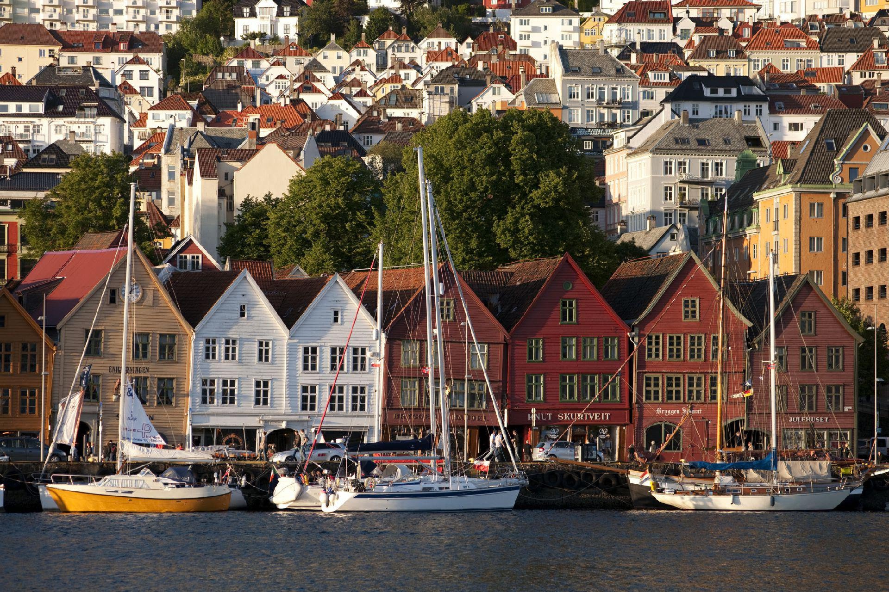
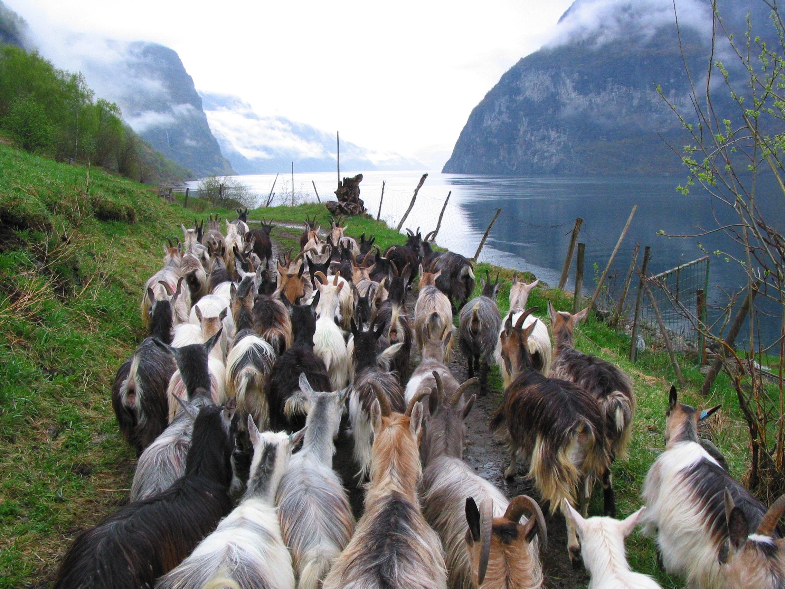
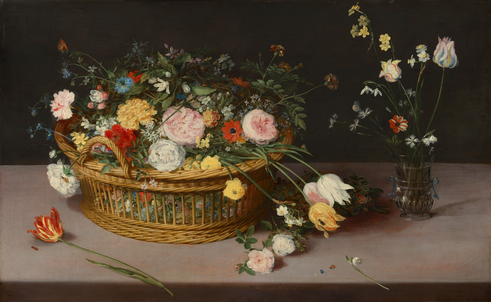
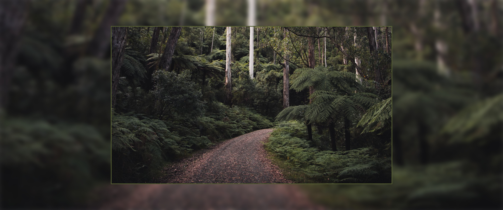
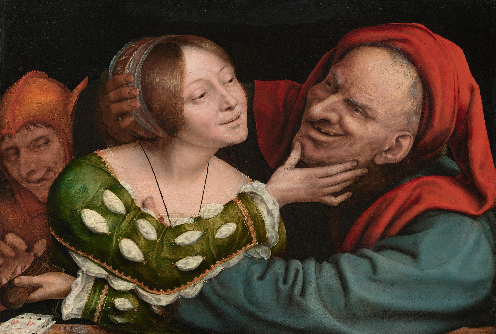
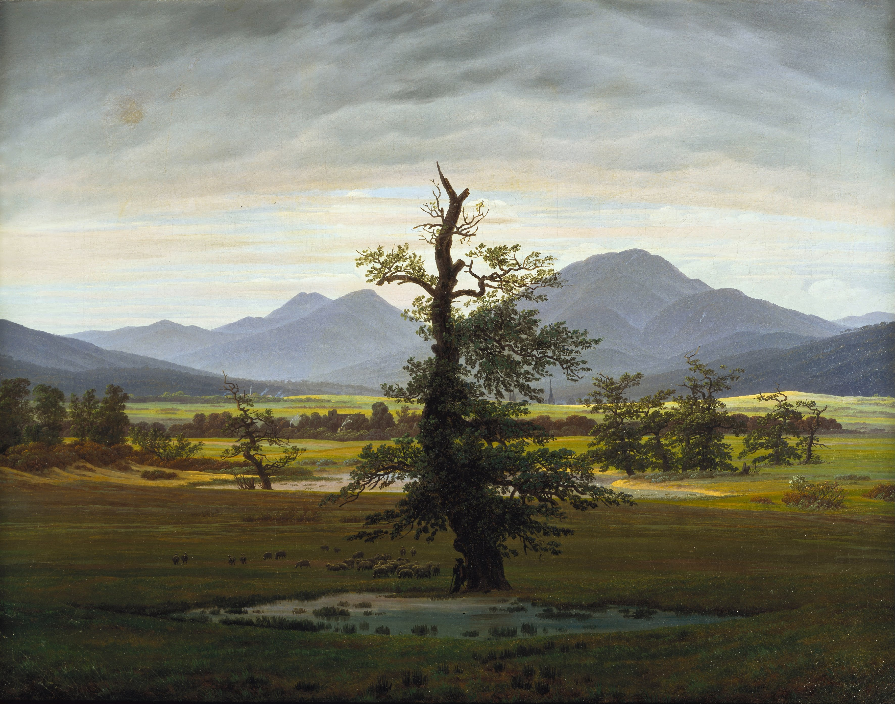
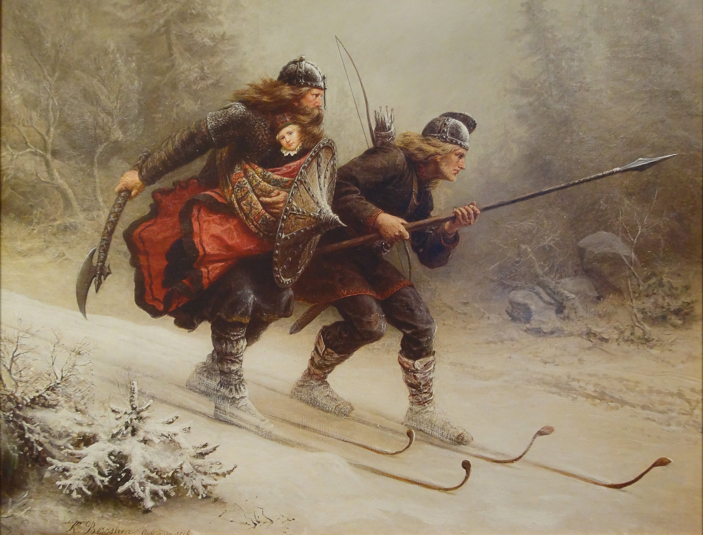

# Gruvbox Wallpapers for Omarchy

A curated set of wallpapers themed around the Gruvbox palette for Omarchy.

## Gallery

<table>
  <tr><td width="220" align="center"><br><sub>abbey-ruins-melancholy.jpg</sub></td><td width="220" align="center"><br><sub>alpine-lake-epic.png</sub></td><td width="220" align="center"><br><sub>bar-window-cozy.jpg</sub></td></tr>
  <tr><td width="220" align="center"><br><sub>bergen-bryggen-sunny.jpg</sub></td><td width="220" align="center"><br><sub>berry-branch-earthy.jpg</sub></td><td width="220" align="center"><br><sub>berry-bush-moody.jpg</sub></td></tr>
  <tr><td width="220" align="center"><br><sub>bonsai-window-gentle.jpg</sub></td><td width="220" align="center"><br><sub>bookshelf-amber-cozy.jpeg</sub></td><td width="220" align="center"><br><sub>brick-alley-noir.jpg</sub></td></tr>
  <tr><td width="220" align="center"><br><sub>canyon-river-rugged.jpg</sub></td><td width="220" align="center"><br><sub>cavalry-battle-chaos.png</sub></td><td width="220" align="center"><br><sub>cosmic-ruins-apocalyptic.png</sub></td></tr>
  <tr><td width="220" align="center"><br><sub>cowboy-mesa-wander.jpg</sub></td><td width="220" align="center"><br><sub>diner-night-lonely.jpg</sub></td><td width="220" align="center"><br><sub>edison-bulb-amber.jpg</sub></td></tr>
  <tr><td width="220" align="center"><br><sub>fantasy-river-enchanted.jpg</sub></td><td width="220" align="center"><br><sub>fern-shadowed-calm.jpg</sub></td><td width="220" align="center"><br><sub>firewood-snowy-rustic.jpg</sub></td></tr>
  <tr><td width="220" align="center"><br><sub>fjord-goat-herd.jpg</sub></td><td width="220" align="center"><br><sub>fjord-harbor-misty.jpg</sub></td><td width="220" align="center"><br><sub>flower-basket-opulent.jpg</sub></td></tr>
  <tr><td width="220" align="center"><br><sub>forest-cabin-misty.png</sub></td><td width="220" align="center"><br><sub>forest-lake-reflective.png</sub></td><td width="220" align="center"><br><sub>forest-path-quiet.jpg</sub></td></tr>
  <tr><td width="220" align="center"><br><sub>forest-railway-lush.jpg</sub></td><td width="220" align="center"><br><sub>forest-stairs-misty.jpg</sub></td><td width="220" align="center"><br><sub>garden-tending-gentle.png</sub></td></tr>
  <tr><td width="220" align="center"><br><sub>harbor-fleet-stately.jpg</sub></td><td width="220" align="center"><br><sub>japan-alley-quiet.png</sub></td><td width="220" align="center"><br><sub>jesters-mischief-renaissance.jpg</sub></td></tr>
  <tr><td width="220" align="center"><br><sub>jungle-bridge-adventure.jpg</sub></td><td width="220" align="center"><br><sub>koi-pond-tranquil.png</sub></td><td width="220" align="center"><br><sub>kyoto-street-amber.png</sub></td></tr>
  <tr><td width="220" align="center"><br><sub>lakehouse-reflection-quiet.jpg</sub></td><td width="220" align="center"><br><sub>lamplit-room-solitude.jpg</sub></td><td width="220" align="center"><br><sub>latte-topdown-warm.jpg</sub></td></tr>
  <tr><td width="220" align="center"><br><sub>lone-tree-serene.jpg</sub></td><td width="220" align="center"><br><sub>night-shop-neon.jpg</sub></td><td width="220" align="center"><br><sub>rail-tunnel-haunted.jpg</sub></td></tr>
  <tr><td width="220" align="center"><br><sub>rainy-window-soft.jpg</sub></td><td width="220" align="center"><br><sub>record-player-nostalgic.jpg</sub></td><td width="220" align="center"><br><sub>ruins-obelisk-ancient.jpg</sub></td></tr>
  <tr><td width="220" align="center"><br><sub>ski-rescue-brave.jpg</sub></td><td width="220" align="center"><br><sub>spiral-staircase-dramatic.jpg</sub></td><td width="220" align="center"><br><sub>stadium-lake-dusk.jpg</sub></td></tr>
  <tr><td width="220" align="center"><br><sub>stave-church-historic.jpg</sub></td><td width="220" align="center"><br><sub>string-lights-bokeh.jpg</sub></td><td width="220" align="center"><br><sub>swamp-log-still.jpg</sub></td></tr>
  <tr><td width="220" align="center"><br><sub>tavern-feast-rowdy.jpg</sub></td><td width="220" align="center"><br><sub>tree-lights-festive.jpg</sub></td><td width="220" align="center"><br><sub>typewriter-vintage-muted.jpg</sub></td></tr>
  <tr><td width="220" align="center"><br><sub>village-procession-idyllic.jpg</sub></td><td width="220" align="center"><br><sub>village-square-bucolic.jpg</sub></td><td width="220" align="center"><br><sub>wood-bridge-mossy.jpg</sub></td></tr>
</table>

## Install

Clone the repo, then open Omarchy's background installer and import the wallpapers from the cloned folder.

```bash
git clone https://github.com/OldJobobo/omarchy-gruvbox-bg-addon.git
```
Make sure you change to the Gruvbox theme or whatever theme you want to add the wallpaper(s) to, then do:

1. Open the installer:
   - `omarchy-theme-bg-install`

   or

   - Omarchy Menu >
     Install > Style > Background
2. When the folder opens, drag wallpapers from your cloned `omarchy-gruvbox-bg-addon` folder into it.

## Contributing Wallpapers

Want to add your own Gruvbox themed wallpaper? We'd love your contribution! Here's a simple step-by-step guide:

### Step 1: Fork the Repository
1. Click the **Fork** button at the top right of this page
2. This creates your own copy of the repository

### Step 2: Upload Your Wallpaper

#### Option A: Using GitHub's Website (Easiest!)
1. Go to **your forked repository** (it will be at `https://github.com/YOUR-USERNAME/omarchy-gruvbox-bg-addon`)
2. Click **Add file** -> **Upload files**
3. Drag and drop your wallpaper image(s) or click to browse
4. Give your wallpaper a descriptive filename (e.g., `forest-cabin-misty.jpg`)
5. Scroll down and click **Commit changes**

#### Option B: Using Git (If you're comfortable with command line)
1. Clone your forked repository:
```bash
git clone https://github.com/YOUR-USERNAME/omarchy-gruvbox-bg-addon.git
cd omarchy-gruvbox-bg-addon
```
2. Copy your wallpaper file into the repository folder
3. Add and commit your changes:
```bash
git add your-wallpaper-name.jpg
git commit -m "Add new wallpaper: your-wallpaper-name.jpg"
git push
```

### Step 3: Submit a Pull Request
1. Go back to **your forked repository** on GitHub
2. Click the **Contribute** button, then **Open pull request**
3. Add a brief description of your wallpaper
4. Click **Create pull request**

That's it! I'll review your submission and merge it if it fits the Gruvbox theme.

### Wallpaper Guidelines
- **Theme**: Should match the Gruvbox color palette (warm browns, muted greens, soft golds)
- **Format**: JPG or PNG
- **Resolution**: 2560x1440 minimum
- **Filename**: Use descriptive, lowercase names with dashes (e.g., `forest-cabin-misty.jpg`)
